# Agency Dashboard - System Design Documentation

## Overview
The Agency Dashboard is a Next.js application that provides authenticated access to educational agencies and their contacts, with usage tracking and rate limiting features.

---

## System Architecture Diagram


---

## Component Flow Diagrams

### 1. User Authentication Flow


### 2. Contact Viewing Flow (with Rate Limiting)

```mermaid
flowchart TD
    Start([User Clicks Page N]) --> API[GET /api/contacts?page=N]
    API --> GetUsage["Get/Create DailyUsage Record
    userId + today's date"]
    GetUsage --> Parse["Parse Tracking Data:
    • viewedPages this hour
    • allTimeViewedPages persistent"]
    Parse --> CheckPage{"Is Page N in
    allTimeViewedPages?"}
    
    CheckPage -->|YES - Previously Viewed| Fetch[Fetch 10 Contacts from DB]
    CheckPage -->|NO - New Page| CheckLimit{"Check Daily Limit:
    contactViews >= 50?"}
    
    CheckLimit -->|YES - Limit Reached| Error429[Return 429 Error]
    CheckLimit -->|NO - Within Limit| Update["Increment Views
    Add to tracking
    contactViews +10"]
    
    Update --> Fetch
    Fetch --> Return["Return JSON:
    • contacts
    • pagination
    • tracking"]
    
    style Start fill:#e3f2fd,stroke:#01579b,stroke-width:2px,color:#000
    style API fill:#f3e5f5,stroke:#4a148c,stroke-width:2px,color:#000
    style GetUsage fill:#fff3e0,stroke:#e65100,stroke-width:2px,color:#000
    style Parse fill:#e8f5e9,stroke:#1b5e20,stroke-width:2px,color:#000
    style CheckPage fill:#fff9c4,stroke:#f57f17,stroke-width:2px,color:#000
    style CheckLimit fill:#fff9c4,stroke:#f57f17,stroke-width:2px,color:#000
    style Error429 fill:#ffebee,stroke:#c62828,stroke-width:2px,color:#000
    style Update fill:#e1f5fe,stroke:#01579b,stroke-width:2px,color:#000
    style Fetch fill:#f3e5f5,stroke:#4a148c,stroke-width:2px,color:#000
    style Return fill:#e8f5e9,stroke:#1b5e20,stroke-width:2px,color:#000
```



### 3. Data Reset Flow

```mermaid
flowchart TD
    Start["Check Total Pages vs
    All-Time Viewed Pages"] --> Decision{"All pages viewed?
    allTimeViewedPages.length
    >= totalPages"}
    
    Decision -->|YES| Reset[Reset Array to []]
    Decision -->|NO| Continue[Continue Tracking]
    
    style Start fill:#e3f2fd,stroke:#01579b,stroke-width:2px,color:#000
    style Decision fill:#fff9c4,stroke:#f57f17,stroke-width:2px,color:#000
    style Reset fill:#ffebee,stroke:#c62828,stroke-width:2px,color:#000
    style Continue fill:#e8f5e9,stroke:#1b5e20,stroke-width:2px,color:#000
```

---

## Key Features & Components

### 1. **Authentication (Clerk)**
- Middleware-based route protection
- Public routes: `/sign-in`, `/sign-up`
- Protected routes: All dashboard pages
- User session management

### 2. **Rate Limiting System**
- **Daily Limit**: 50 contacts per day
- **Per Page**: 10 contacts
- **Smart Tracking**:
  - `viewedPages`: Current hour's viewed pages
  - `allTimeViewedPages`: Persistent tracking (never counts twice)
  - Auto-reset when all pages viewed

### 3. **Database Schema**
- **Agency**: Educational institutions (15+ fields)
- **Contact**: Individual contacts linked to agencies
- **DailyUsage**: User activity tracking
  - Unique constraint: `userId + date`
  - Tracks views, pages, and limit status

### 4. **Pagination System**
- Client-side page selection
- Visual indicators:
  - 🔵 Blue: Current page
  - 🟢 Green: Previously viewed (free)
  - 🟡 Yellow: Viewed this hour
  - ⚪ White: Not viewed

---

## Technology Stack


---

## API Endpoints

### `GET /api/agencies`
**Purpose**: Retrieve all agencies  
**Auth**: Required  
**Returns**: Array of Agency objects

### `GET /api/contacts?page={N}`
**Purpose**: Retrieve paginated contacts with rate limiting  
**Auth**: Required  
**Parameters**:
- `page`: Page number (default: 1)

**Response**:
```json
{
  "contacts": [...],
  "totalContacts": 500,
  "currentPage": 1,
  "totalPages": 50,
  "contactViews": 10,
  "limit": 50,
  "viewedPages": [1],
  "allTimeViewedPages": [1]
}
```

**Error Response (429)**:
```json
{
  "error": "Daily limit reached",
  "limitReached": true,
  "contactViews": 50,
  "limit": 50
}
```

---

## State Management

### Client State (React)
```typescript
// Contacts Page State
- contacts: Contact[]           // Current page data
- loading: boolean              // Loading indicator
- error: string | null          // Error messages
- currentPage: number           // Active page
- totalPages: number            // Total pages
- totalContacts: number         // Total count
- viewedPages: number[]         // Pages viewed this hour
- allTimeViewedPages: number[]  // All-time viewed pages
- limitReached: boolean         // Limit status
```

### Server State (Database)
```typescript
// DailyUsage Record
- userId: string                // User identifier
- date: DateTime                // UTC date (midnight)
- contactViews: number          // Total views today
- viewedPages: string           // CSV of pages (hour)
- allTimeViewedPages: string    // CSV of all pages
- limitReachedAt: DateTime?     // When limit hit
```

---

## Security Considerations

1. **Authentication**: Clerk middleware on all routes
2. **Authorization**: User-specific tracking (userId)
3. **Rate Limiting**: Server-side enforcement
4. **Data Isolation**: Users only see their own usage stats
5. **SQL Injection**: Prevented by Prisma ORM

---

## Deployment Considerations

### Environment Variables
```bash
DATABASE_URL=              # PostgreSQL connection
NEXT_PUBLIC_CLERK_*=       # Clerk authentication keys
```

### Database Migrations
```bash
prisma migrate dev         # Development
prisma migrate deploy      # Production
```

### Build Process
```bash
npm run build
# Includes: prisma generate + next build
```

---

## Future Enhancements

1. **Analytics Dashboard**
   - Usage trends over time
   - Popular agencies/contacts

2. **Export Functionality**
   - CSV export of viewed contacts
   - Filtered exports

3. **Search & Filters**
   - Search by name, email, agency
   - State/location filters

4. **Premium Tiers**
   - Unlimited views
   - Advanced features

5. **Caching Layer**
   - Redis for frequently accessed data
   - Reduce database load

---

## Monitoring & Logging

Recommended monitoring points:
- API response times
- Database query performance
- Rate limit hits
- Authentication failures
- Daily active users

---

*Last Updated: November 29, 2025*
